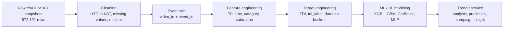

<p align="center">
  
</p>

<h1 align="center">📈 TrendIt</h1>

<p align="center">
  <b>YouTube KR 트렌딩 데이터를 기반으로 콘텐츠 성과와 지속 가능성을 예측하는 분석 플랫폼</b>
</p>

<p align="center">
  트렌딩 진입 시점의 초기 신호, 카테고리 특성, 시간 패턴을 결합해<br/>
  “이 영상은 짧게 지나갈 트렌드인가, 오래 유지될 트렌드인가?”를 데이터로 판단합니다.
</p>

<p align="center">
  
  
  
  
  
  
  
</p>

<p align="center">
  <a href="#프로젝트-개요">프로젝트 개요</a> ·
  <a href="#핵심-성과">핵심 성과</a> ·
  <a href="#분석-파이프라인">분석 파이프라인</a> ·
  <a href="#모델링">모델링</a> ·
  <a href="#실행-방법">실행 방법</a>
</p>

<table>
  <tr>
    <td width="33%">
      <h3>🎬 Content Signal</h3>
      <p>진입 순위, 초기 조회수, 댓글 반응, 업로드 시간대를 T0 기준으로 해석합니다.</p>
    </td>
    <td width="33%">
      <h3>🧠 Predictive Model</h3>
      <p>ML 앙상블과 DL 구간 분류를 결합해 성과형 트렌딩과 장기 지속 가능성을 예측합니다.</p>
    </td>
    <td width="33%">
      <h3>🚦 Campaign Insight</h3>
      <p>카테고리별 지속 패턴을 바탕으로 업로드 타이밍과 캠페인 우선순위를 제안합니다.</p>
    </td>
  </tr>
</table>

## ✨ 프로젝트 개요

YouTube 트렌딩 차트는 알고리즘이 국가별 상위 영상을 짧은 주기로 노출하는 공간입니다. 하지만 트렌딩에 진입한 영상이 모두 같은 성과를 내지는 않습니다. 어떤 영상은 몇 시간 만에 사라지고, 어떤 영상은 며칠 이상 상위권을 유지합니다.

TrendIt은 YouTube KR 트렌딩 데이터의 스냅샷을 이벤트 단위로 재구성하고, 진입 시점에 알 수 있는 정보만으로 트렌딩 성과와 지속 시간을 예측합니다. 분석 결과는 콘텐츠 업로드 타이밍, 카테고리별 캠페인 전략, 장기 지속 후보 선별에 활용할 수 있습니다.

<table>
  <tr>
    <td align="center"><b>872,191</b><br/><sub>원본 스냅샷</sub></td>
    <td align="center"><b>34,964</b><br/><sub>최종 전처리 이벤트</sub></td>
    <td align="center"><b>2022-2025</b><br/><sub>수집 기간</sub></td>
    <td align="center"><b>5 groups</b><br/><sub>카테고리 정규화</sub></td>
  </tr>
</table>

## 👥 팀원 소개

| 이름 | 담당 영역 |
|---|---|
| 이동윤 | DB 구축, 머신러닝 |
| 성주연 | 데이터 구축, 머신러닝 |
| 김은진 | 데이터 전처리, 딥러닝 |
| 한경찬 | 데이터 전처리, 클러스터링 |
| 양정현 | 프론트엔드, 백엔드 |

## 🎯 핵심 성과

| 기준 | 지표 | 결과 | 의미 |
|---|---|---:|---|
| 최종 Test (T0) | Classification AUC-ROC | **0.8284** | 성과형 트렌딩 여부 판별 |
| 최종 Test (T0) | F1-Score | **0.6756** | 최종 일반화 성능 기준의 분류 균형 |
| 최종 Test (T0) | Regression R² | **0.5322** | 지속 시간 회귀 모델의 설명력 |
| 최종 Test (T0) | Regression RMSE | **0.9147** | 로그/정규화 스케일 기준 오차 |
| 구간 분류 | `>48h` AUC / F1 | **0.8708 / 0.8717** | 2일 이상 지속 후보 탐지 |
| 구간 분류 | `>120h` AUC / F1 | **0.8429 / 0.7456** | 5일 이상 지속 가능성 판단 |

> 🧷 **평가 기준 메모**  
> 모델 메타데이터에는 `F1=0.7681`, `Accuracy=0.8076`이 저장되어 있지만, 학습 결과서의 종합 비교에서는 `F1=0.6756`을 최종 Test 기준으로 명시합니다. README의 핵심 성과 표는 면접 및 리뷰에서 더 보수적인 기준인 **최종 Test 성능**을 우선 사용했습니다.

## 🔎 핵심 질문

| 질문 | 분석 접근 |
|---|---|
| 카테고리 그룹별 트렌딩 지속 시간은 유의미하게 다른가? | Kruskal-Wallis, 카테고리별 지속 시간 비교 |
| 트렌딩 진입 순간의 정보만으로 지속 시간을 예측할 수 있는가? | T0-only 회귀 및 분류 모델 |
| 기준 이상 오래 지속될 영상을 분류할 수 있는가? | `tdi_label`, Duration Bucket SurvivalNet |
| 같은 카테고리 안에도 다른 트렌딩 패턴이 존재하는가? | 클러스터링 및 사후 EDA |

## 🧭 분석 파이프라인



### 데이터 설계 원칙

| 원칙 | 설명 |
|---|---|
| 원본 보존 | `trending_snapshots`는 read-only로 유지하고 파생 데이터는 별도 테이블에 저장 |
| 누수 방지 | T0 이후에만 알 수 있는 값은 T0-only 모델 입력에서 제외 |
| 모델 분리 | T0-only 모델과 T0+24h 모델을 독립적으로 학습 및 비교 |
| 타겟 분리 | `TDI`, `tdi_label`, `trending_duration_h`는 예측 대상이며 입력 피처로 사용하지 않음 |

## 🧱 데이터와 타겟

### 데이터셋

| 항목 | 내용 |
|---|---|
| 데이터 | Global YouTube Trending Dataset |
| 범위 | KR 트렌딩, 2022년 7월-2025년 6월 |
| 수집 방식 | YouTube Data API 기반 하루 4회 스냅샷, 약 6시간 간격 |
| 저장 포맷 | Parquet |
| 분석 단위 | `video_id + event_id` 복합키 기반 트렌딩 이벤트 |

### TDI

단순히 오래 지속된 영상이 아니라, 높은 순위 품질을 함께 유지한 영상을 성과형 트렌딩으로 정의했습니다.

```text
TDI = (trending_duration_h / cat_q95_duration) * (1 - (best_rank - 1) / 200)
```

| 타겟 | 정의 |
|---|---|
| `trending_duration_h` | 트렌딩 진입 시점부터 이탈 시점까지의 지속 시간 |
| `TDI` | 카테고리별 지속 시간 기준과 최고 순위를 함께 반영한 복합 지수 |
| `tdi_label` | `TDI >= 0.4`이면 성과형 트렌딩 1, 그 외 0 |
| Duration Bucket | `>48h`, `>120h`, `>240h` 장기 지속 가능성 |

## 🤖 모델링

### 최종 운영 모델

| 목적 | 선택 모델 | 판단 근거 |
|---|---|---|
| 성과형 영상 여부 판단 | Weighted Soft Voting | 최종 Test AUC 0.8284 |
| 지속 시간 회귀 | ML T0 회귀 모델 | 최종 Test R² 0.5322 |
| 장기 지속 확률 | Duration Bucket SurvivalNet | `>48h` AUC 0.8708, `>120h` AUC 0.8429 |
| 딥러닝 교차 검증 | MLP + Embedding | TabNet 대비 AUC, F1, 학습 시간 우수 |

### 최종 모델 메타데이터

| 항목 | 내용 |
|---|---|
| 모델명 | Weighted Soft Voting |
| 구성 | XGBoost + LightGBM + RandomForest (메타데이터 기준) |
| 실험 후보 | XGBoost, LightGBM, CatBoost, RandomForest, MLP, TabNet |
| 버전 | v1.0.0 |
| 저장일 | 2026-05-04 |
| 입력 피처 | `entry_rank_log`, `T0_view_log`, `T0_engagement_ratio_log`, `latency_to_trend_log`, `pretrend_view_velocity_log`, `weekday_sin`, `weekday_cos`, `hour_sin`, `hour_cos`, `category_group` |

### 주요 피처 인사이트

| 피처 | 해석 |
|---|---|
| `entry_rank_log` | 트렌딩 진입 시점의 순위가 높을수록 성과형 트렌딩 가능성이 커짐 |
| `latency_to_trend_log` | 업로드 후 트렌딩 진입까지의 시간은 초기 확산 속도를 설명 |
| `T0_view_log` | 진입 시점 조회수는 이후 지속성을 예측하는 강한 초기 신호 |
| `category_group` | 카테고리별 소비 패턴과 트렌딩 지속 구조 차이를 반영 |
| `hour_sin`, `hour_cos` | 업로드 시간대와 시청 패턴의 주기성을 반영 |

## 🖥️ 서비스 화면

<details open>
<summary><b>분석 페이지</b></summary>
<br/>

</details>

<details>
<summary><b>전체 랜딩 페이지</b></summary>
<br/>

</details>

<details>
<summary><b>데이터베이스 ERD</b></summary>
<br/>

</details>

## 🧩 주요 기능

| 기능 | 설명 |
|---|---|
| 트렌딩 분석 | 카테고리, 조회수, 지속 시간, 순위 흐름 기반 EDA 제공 |
| 영상 분석 | 개별 영상의 초기 반응과 지속 가능성 확인 |
| 지속성 분석 | T0 신호 기반 트렌딩 지속 시간과 장기 지속 확률 추정 |
| 캠페인 플래너 | 카테고리별 업로드 요일, 시간대, 전략 인사이트 제공 |
| 대시보드 | 핵심 지표와 모델 결과를 한 화면에서 탐색 |

## 📁 프로젝트 구조

```text
backend/
  api/
    main.py
    routes/
      eda.py
      feature.py
      model.py
      predict.py
      sustain.py
      campaign.py
      dashboard.py
  data/
    video_trending_events_T0_model.parquet
    video_trending_events_24h_model.parquet
    video_trending_events_analysis.parquet
  ml/
    train_weighted_ensemble.py
    train_xgb_models.py
    lstm/train_lstm_trend.py
  models/
    weighted_soft_voting.joblib
    xgb_tdi_t0.joblib
    xgb_duration_t0.joblib
  preprocessing/
    clean.py
    event_split.py
    features.py
    saturation.py
    target.py

frontend/
  src/
    pages/
      LandingPage.jsx
      TrendingPage.jsx
      FeaturePage.jsx
      ModelPage.jsx
      PredictionPage.jsx
      CampaignPlannerPage.jsx
    components/
    constants/
    styles/
```

## 🚀 실행 방법

### 1. Backend

```bash
cd backend
python -m venv .venv
source .venv/bin/activate
pip install -r requirements_ensemble.txt
uvicorn api.main:app --reload
```

Windows PowerShell에서는 가상환경 활성화 명령만 아래처럼 실행합니다.

```powershell
.\.venv\Scripts\Activate.ps1
```

API 문서는 기본 설정 기준 `http://127.0.0.1:8000/docs`에서 확인할 수 있습니다.

### 2. Frontend

```bash
cd frontend
npm install
npm run dev
```

Vite 개발 서버는 기본 설정 기준 `http://localhost:5173`에서 실행됩니다.

### 3. 환경 변수

```bash
cp backend/.env.example backend/.env
```

데이터베이스 연결 정보, API URL, 모델 및 데이터 경로는 각 환경에 맞게 `.env`에서 설정합니다.

## 🛠️ 기술 스택

| 영역 | 기술 |
|---|---|
| Frontend | React, Vite, React Router, Recharts, Framer Motion |
| Backend | Python, FastAPI, pandas, NumPy |
| Machine Learning | scikit-learn, XGBoost, LightGBM, CatBoost, Optuna |
| Deep Learning | PyTorch, MLP, TabNet, Survival-style bucket classification |
| Data | MySQL, Parquet |
| Visualization | Matplotlib, Recharts |

## 💡 분석 결과 요약

1. 카테고리는 트렌딩 지속성의 핵심 구조 변수입니다.
2. 진입 시점 순위, 조회수, 댓글 비율, 진입 속도는 T0 시점에서 활용 가능한 강한 예측 신호입니다.
3. 무작정 피처를 늘리는 것보다 누수 없는 핵심 피처와 시간 정보를 유지하는 편이 일반화 성능에 유리했습니다.
4. 정확한 지속 시간을 직접 맞히는 회귀에는 한계가 있었지만, 2일 이상 또는 5일 이상 지속 여부는 안정적으로 분류할 수 있었습니다.
5. 최종 의사결정에는 ML 모델의 성과형 확률과 DL SurvivalNet의 장기 지속 확률을 함께 사용하는 하이브리드 방식이 적합합니다.

## 🧪 주로 묻는 질문

| 질문 | 답변 |
|---|---|
| 왜 TDI를 만들었나요? | 단순 지속 시간은 카테고리별 구조 차이가 있어 불공정하므로, 지속 시간과 최고 순위를 함께 반영한 성과형 지표로 보정했습니다. |
| 데이터 누수는 어떻게 막았나요? | T0-only 모델에는 T0 이후에 알 수 있는 `view_growth_24h`, `best_rank`, `T_end_*`, `TDI` 등을 입력하지 않았습니다. |
| 회귀 MAE 목표와 실제 결과 차이는 어떻게 설명하나요? | 트렌딩 지속 시간은 long-tail 분포이고 6시간 스냅샷 간격의 측정 오차가 있어 절대 종료 시점 예측은 어렵습니다. 그래서 회귀와 함께 구간 분류 모델을 보조 의사결정 지표로 제안했습니다. |
| 왜 최종 성능이 후보 성능보다 낮나요? | 후보 비교 및 Validation 성능보다 최종 Test 성능이 실제 일반화 성능에 가깝습니다. README는 과장된 후보 성능보다 최종 Test 수치를 우선 표기했습니다. |
| 프로젝트의 실무 활용 포인트는 무엇인가요? | 업로드 직후 1차 성공 가능성, 2일/5일 이상 지속 가능성, 카테고리별 캠페인 타이밍을 함께 판단하는 데 활용할 수 있습니다. |

## 📝 한 줄 회고

<table>
  <tr>
    <td height="44"></td>
  </tr>
</table>

## 📚 참고

- Data Scope: Global YouTube Trending KR 2022-2025
- Dataset: Illinois Data Bank IDB-9307654, Ng & Goncalves (2025), CC BY 4.0
- Project: SKN 29, Team 1
